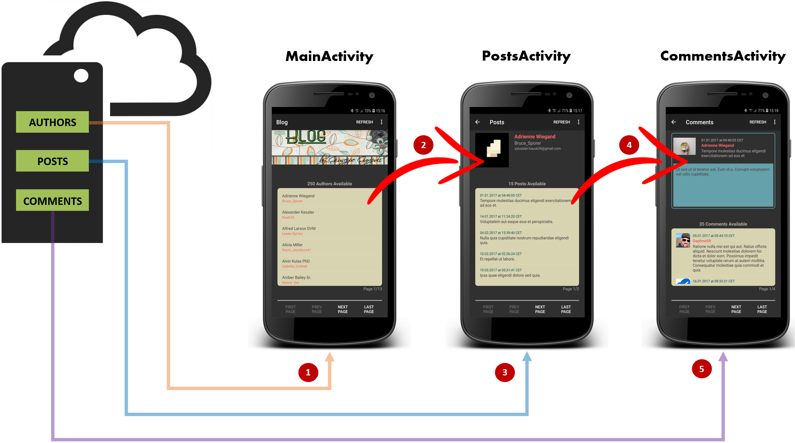

The goal of this project is to implement an Android Application that communicates with a Web Server to retrieve information about authors, posts and comments.

The application is using Google Volley as HTTP library to communicate with the Server and to perform the caching and retry mechanisms. 

When the user starts the application, the first screen shows the list of authors available on the Blog.

Once a specific author is selected, the user is redirected to another page listing all the posts related to that author, with the addition of further information about the author, such as photo, email, address.

Finally, once a specific post is selected, the user is redirected to the final page which is listing all the comments related to that post, with the addition of further information about the post itself such as picture, date, title, content.

